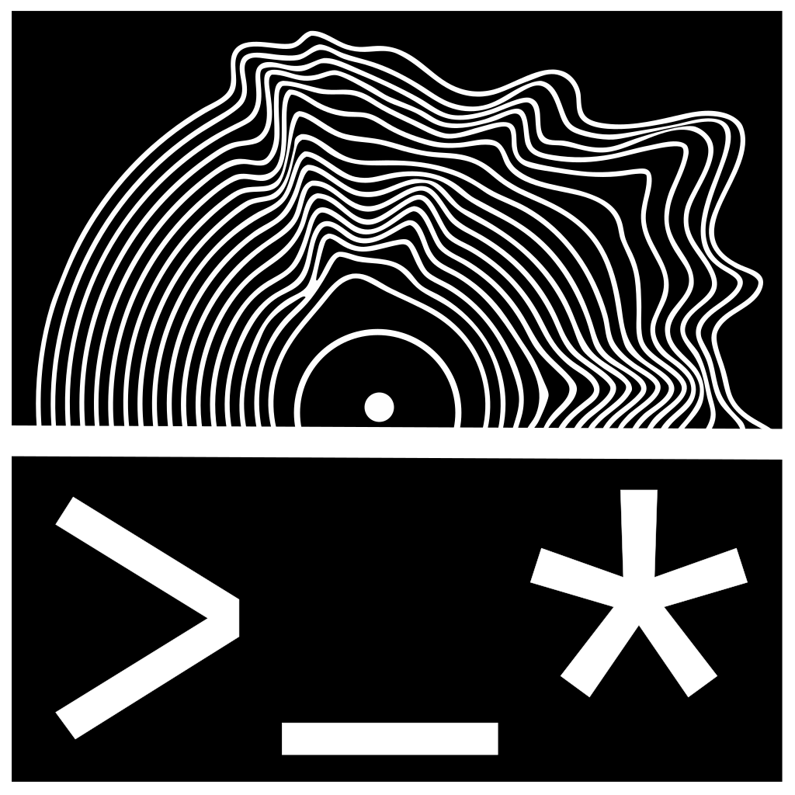
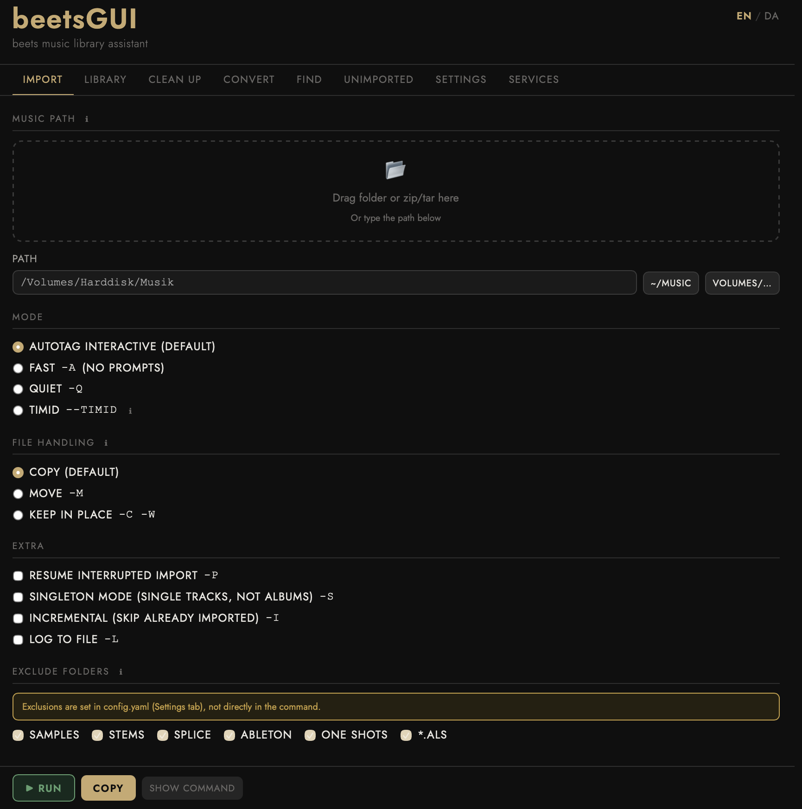

# beetsGUI



A local web GUI for [beets](https://beets.io) — runs as a standalone macOS app via Safari Web App.

No Electron. No Docker. Just a small Flask server and a single HTML file.



## Features

- **Import** — configure and run `beet import` with all options
- **Library** — search and export your collection
- **Clean up** — manage duplicates, cover art, metadata
- **Convert** — find WAV/AIFF files; auto-convert lossless → ALAC on import (via ffmpeg)
- **Find** — fast file search with `fd`
- **Unimported** — scan a folder for music not yet in beets
- **Settings** — edit `config.yaml` directly in the app, generate config from UI
- **Services** — configure Discogs, MusicBrainz, Beatport4
- Bilingual: 🇩🇰 Danish / 🇬🇧 English
- Dark + light mode (follows macOS system preference)

## Requirements

- macOS (Ventura or later recommended for Safari Web App)
- [beets](https://beets.io) — `pipx install beets`
- Flask — already included in beets' pipx environment:
  ```bash
  pipx inject beets flask
  ```
- ffmpeg (optional, for lossless → ALAC conversion):
  ```bash
  brew install ffmpeg
  ```

## Setup

### 1. Clone

```bash
git clone https://github.com/YOUR_USERNAME/beetsgui.git
cd beetsgui
```

### 2. Start the server

```bash
# If Flask is in beets' pipx environment:
~/.local/pipx/venvs/beets/bin/python server.py

# Or if Flask is in your system Python:
python3 server.py
```

Open http://localhost:1312 in Safari.

### 3. Create a Safari Web App (macOS standalone)

With http://localhost:1312 open in Safari:
**File → Add to Dock → name it "beetsGUI"**

The server will now open the standalone app automatically on next launch.

### 4. Create a launcher (Automator)

Open **Automator → New → Application → Run Shell Script**:

```bash
/path/to/python server.py
# Example with pipx beets:
# ~/.local/pipx/venvs/beets/bin/python /path/to/beetsgui/server.py
```

Save as `beetsGUI Launcher.app`, drag to Dock. One click starts everything.

## DJ workflow notes

- Lossless files (WAV, AIFF, FLAC) convert to **ALAC 24-bit** on import — 32-bit float is handled automatically
- MP3 and AAC are never re-encoded
- Designed for Traktor / Lexicon / Rekordbox workflows

## Beets plugins supported in Settings UI

Metadata sources: `musicbrainz` `chroma` `beatport4` `discogs` `deezer` `spotify` `tidal`

Enrichment: `fetchart` `embedart` `lastgenre` `fromfilename` `bpsync` `autobpm` `keyfinder` `replaygain` `lyrics`

Maintenance: `duplicates` `missing` `mbsync` `importfeeds` `dirfields` `scrub` `smartplaylist` `unimported`

## Contributing

Pull requests welcome. This started as a personal tool for a DJ/electronic music collection — if you have a different workflow, open an issue.

## About

Built by DR. WARTEMAL — if you'd like to hear what this tool is for, find my music at [soundcloud.com/drwartemal](https://soundcloud.com/drwartemal).

## License

AGPLv3 — see [LICENSE](LICENSE).
