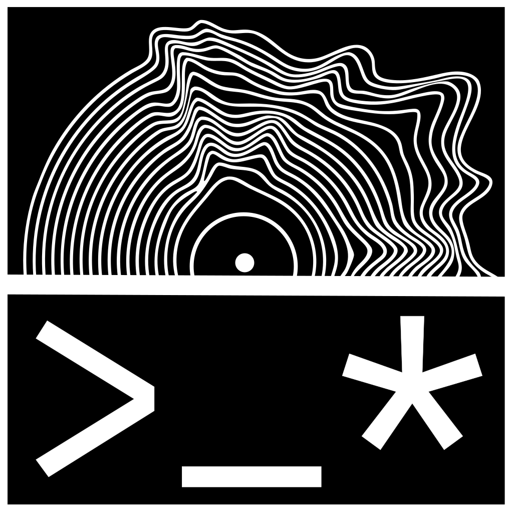
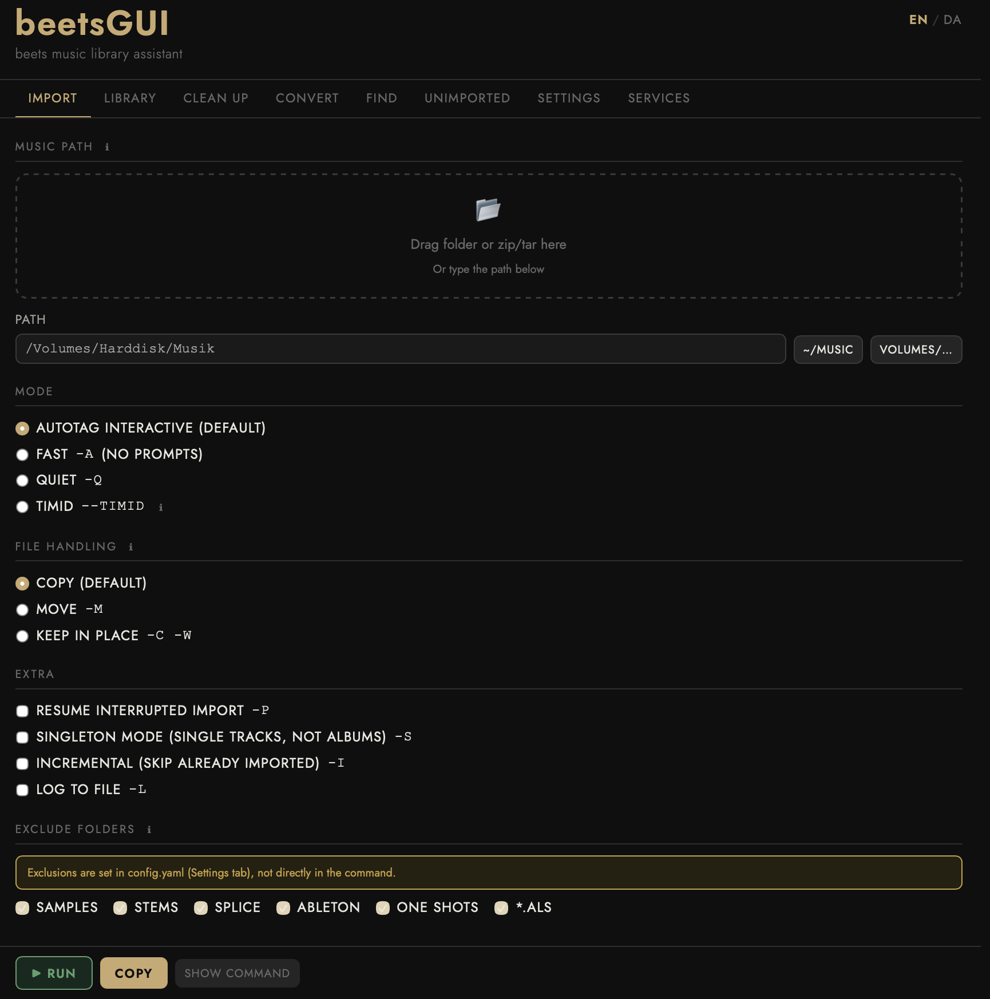

# beetsGUI



A local web GUI for [beets](https://beets.io) — runs as a standalone macOS app via Safari Web App.

No Electron. No Docker. Just a small Flask server and a single HTML file.



## Features

- **Inbox** — scan a folder for music not yet in your library (matches on artist/title, not path, so it's correct however previous imports were copied or moved), then import with a keyboard-driven decision queue for matches and duplicates
- **Library** — search and browse your collection by album, track or artist with a sort control, play tracks in the app with a queue and a seekable transport, manage duplicates, cover art and metadata, convert WAV/AIFF/FLAC to ALAC, remove tracks
- **Export** — playlists and tracklists for Lexicon/Traktor, USB mirror
- **Preferences** (⚙ in the header, or ⌘,) — library/import/plugin config with a live `config.yaml` preview, and Discogs/MusicBrainz/Beatport4 credentials
- Dark + light mode (follows macOS system preference)

## Requirements

- macOS (Ventura or later recommended for Safari Web App)
- [beets](https://beets.io) — `pipx install beets`
- Flask — already included in beets' pipx environment:
  ```bash
  pipx inject beets flask
  ```
- ffmpeg (optional, for lossless → ALAC conversion):
  ```bash
  brew install ffmpeg
  ```

No `fd` needed: the scans that once shelled out to it (Inbox's Utilities,
Library's Formats/WAV-AIFF finder) walk the tree in Python instead.

## Setup

### 1. Clone

```bash
git clone https://github.com/YOUR_USERNAME/beetsgui.git
cd beetsgui
```

### 2. Start the server

```bash
# If Flask is in beets' pipx environment:
~/.local/pipx/venvs/beets/bin/python server.py

# Or if Flask is in your system Python:
python3 server.py
```

Open http://localhost:1612 in Safari.

### 3. Create a Safari Web App (macOS standalone)

With http://localhost:1612 open in Safari:
**File → Add to Dock → name it "beetsGUI"**

The server will now open the standalone app automatically on next launch.

### 4. Keep the server running

The Safari Web App has no code of its own to start the server — it's just a
bookmark-like shortcut to `http://localhost:1612/`. Something else has to
have the server up before you click it.

**Option A — LaunchAgent (recommended):** starts the server at login and
keeps it running, restarting it if it ever crashes. No separate app to
click, ever.

```bash
./scripts/install-launchagent.sh
```

Logs land at `~/Library/Logs/beetsgui-server.log`. To undo:

```bash
launchctl unload ~/Library/LaunchAgents/com.beetsgui.server.plist
rm ~/Library/LaunchAgents/com.beetsgui.server.plist
```

**Option B — Automator launcher:** if you'd rather start the server
manually each time (e.g. it only makes sense running while an external
drive holding your library is mounted), open **Automator → New →
Application → Run Shell Script**:

```bash
/path/to/python server.py
# Example with pipx beets:
# ~/.local/pipx/venvs/beets/bin/python /path/to/beetsgui/server.py
```

Save as `beetsGUI Launcher.app`, drag to Dock. One click starts everything.

## Import

The importer runs **inside** the server through the beets Python API — no
`beet import` subprocess, so match decisions are made in the app instead of
in Terminal. The Inbox tab is a decision queue: candidate cards for
album/track matches, a side-by-side compare for duplicates, and full keyboard
control (`1`-`9` picks a candidate, `Enter` applies, `S` skips, `A` keeps
tags as-is; duplicates use `K`/`S`/`M`/`R` for keep/skip/merge/replace). One
import runs at a time; closing the tab mid-import is safe — reopening the app
rejoins whatever is still running.

Duplicates are ranked by quality before you're ever asked: a lossy copy of an
album already in the library is skipped automatically, a lossless copy
recommends replacing the existing one, and equal-quality duplicates still ask
with no recommendation either way. See `quality_rank()` in `importsession.py`.

The underlying endpoints also work with `curl` alone, for scripting or
debugging:

```bash
# Start: mode is interactive | fast | quiet | timid
# handling is copy | move | keep; incremental and singleton are booleans
curl -s -X POST localhost:1612/import/start -H 'Content-Type: application/json' \
     -d '{"path":"~/Downloads/some album","mode":"interactive","handling":"copy"}'

# Or a curated set of folders (e.g. found while scanning in Inbox, or via an fd search) —
# beets groups them itself, same as `beet import path1 path2`
curl -s -X POST localhost:1612/import/start -H 'Content-Type: application/json' \
     -d '{"paths":["~/Downloads/album1","~/Downloads/album2"],"mode":"interactive"}'
```

```bash
# Watch: status lines, decisions and a final done event, as SSE
curl -sN localhost:1612/import/<id>/events
```

```bash
# Answer a decision. choice is apply|skip|asis|tracks|albums for a match,
# skip|keep|remove|merge for a duplicate, or resume|restart to resume.
curl -s -X POST localhost:1612/import/<id>/decide -H 'Content-Type: application/json' \
     -d '{"decision_id":"<from the event>","choice":"apply","candidate":0}'
```

`POST /import/<id>/abort` cancels cleanly, and `GET /import/current` returns the
running import plus its waiting decision, so a reloaded page can rejoin.
An unanswered decision times out after 15 minutes (`BEETSGUI_DECISION_TIMEOUT`)
and aborts the import rather than blocking the server forever.

Test it end to end (needs ffmpeg; runs against a throwaway library):

```bash
~/.local/pipx/venvs/beets/bin/python test_importsession.py
```

## DJ workflow notes

- Lossless files (WAV, AIFF, FLAC) convert to **ALAC 24-bit** on import — 32-bit float is handled automatically
- MP3 and AAC are never re-encoded
- Designed for Traktor / Lexicon / Rekordbox workflows
- In-app playback decodes in the browser, so it inherits the browser's codec
  support. Safari plays everything this app produces, including ALAC and AIFF;
  Chrome plays MP3, AAC, FLAC and WAV but **not ALAC or AIFF**, so a library
  converted to ALAC on import is Safari-only for preview. Unplayable files say
  so in the player bar rather than failing silently.

## Beets plugins supported in Settings UI

Metadata sources: `musicbrainz` `chroma` `beatport4` `discogs` `deezer` `spotify` `tidal`

Enrichment: `fetchart` `embedart` `lastgenre` `fromfilename` `bpsync` `autobpm` `keyfinder` `replaygain` `lyrics`

Maintenance: `duplicates` `missing` `mbsync` `importfeeds` `dirfields` `scrub` `smartplaylist` `unimported`

## Contributing

Pull requests welcome. This started as a personal tool for a DJ/electronic music collection — if you have a different workflow, open an issue.

## About

Built by DR. WARTEMAL — if you'd like to hear what this tool is for, find my music at [soundcloud.com/drwartemal](https://soundcloud.com/drwartemal).

## License

AGPLv3 — see [LICENSE](LICENSE).
